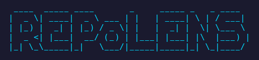

<div align="center">
  
</div>

<div align="center">


</div>

**RepoLens** is a powerful repository intelligence engine that analyzes codebases and generates professional executive-level reports. Get comprehensive insights into your project's health, language distribution, and code quality.

## Quick Start

```bash
git clone https://github.com/yusosadick/RepoLens.git
cd RepoLens
./setup.sh
repolens
```

That's it! The setup script handles everything automatically. You can now run `repolens` from anywhere.

## Features

- **📊 Comprehensive Analysis** - Deep insights into files, lines, and code distribution
- **📝 Professional Reports** - Generate executive-level Markdown, JSON, or CSV reports
- **🏥 Health Scoring** - Repository health assessment (0-10 scale) with actionable recommendations
- **🌐 Language Intelligence** - Detailed language breakdown with ecosystem classification
- **📈 Visual Analytics** - GitHub-style language distribution bars and smart directory trees
- **🎯 Interactive TUI** - Beautiful terminal interface with guided onboarding
- **⚡ CLI Mode** - Full command-line support for automation and scripting
- **🌍 Multi-language** - Interface available in English, Spanish, and Arabic

## Installation

### Prerequisites

- Python 3.11 or higher
- Git CLI (configured and authenticated for GitHub repositories)

### Setup

1. **Clone the repository:**
   ```bash
   git clone https://github.com/yusosadick/RepoLens.git
   cd RepoLens
   ```

2. **Run the setup script:**
   ```bash
   ./setup.sh
   ```

   The script will:
- Create a virtual environment
- Install all dependencies
- Set up the `repolens` command globally

3. **Verify installation:**
   ```bash
   repolens --help
   ```

### Git CLI Configuration

For analyzing GitHub repositories, ensure Git CLI is configured:

```bash
git config --global user.name "your-name"
git config --global user.email "your-email"
gh auth login  # If using GitHub CLI
```

## Usage

### Interactive Mode (Recommended)

Launch the beautiful terminal GUI:

```bash
repolens
```

The interactive mode guides you through:
- Source selection (local directory or GitHub repository)
- Output format selection (Markdown, JSON, or CSV)
- Output directory configuration
- Live progress tracking

### Command-Line Mode

For automation and scripting:

```bash
# Analyze local directory
repolens --dir /path/to/repo --report md

# Analyze GitHub repository
repolens --repo https://github.com/yusosadick/RepoLens --report json --output-dir ./reports

# Export to CSV
repolens --dir . --report csv --output-dir ./output
```

### Report Formats

**Markdown Reports** (Recommended)
- Professional one-page intelligence reports
- Health scoring, language breakdown, visual charts
- Perfect for portfolios and technical audits

**JSON/CSV Exports**
- Machine-readable formats for further analysis
- Complete statistics and metadata

## Requirements

- **Python**: 3.11 or higher
- **Dependencies**:
  - `textual>=0.40.0` - Terminal UI framework
  - `rich>=13.0.0` - Rich text and beautiful formatting
  - `tqdm>=4.65.0` - Progress bars
  - `colorama>=0.4.6` - Cross-platform colored terminal text
  - `pytest>=7.0.0` - Testing framework (dev dependency)

All dependencies are automatically installed by `setup.sh`.

## Troubleshooting

**"externally-managed-environment" error**
- Use the provided `setup.sh` script which handles virtual environments automatically

**"repolens: command not found"**
- Ensure `~/.local/bin` is in your PATH:
  ```bash
  export PATH="$HOME/.local/bin:$PATH"
  ```
- Add to `~/.bashrc` or `~/.zshrc` for persistence

**"python3-venv not found"**
- Install with: `sudo apt install python3.12-venv` (or your Python version)

## License

MIT License - see LICENSE file for details.

## Contributing

Contributions are welcome! Please feel free to submit a Pull Request.
